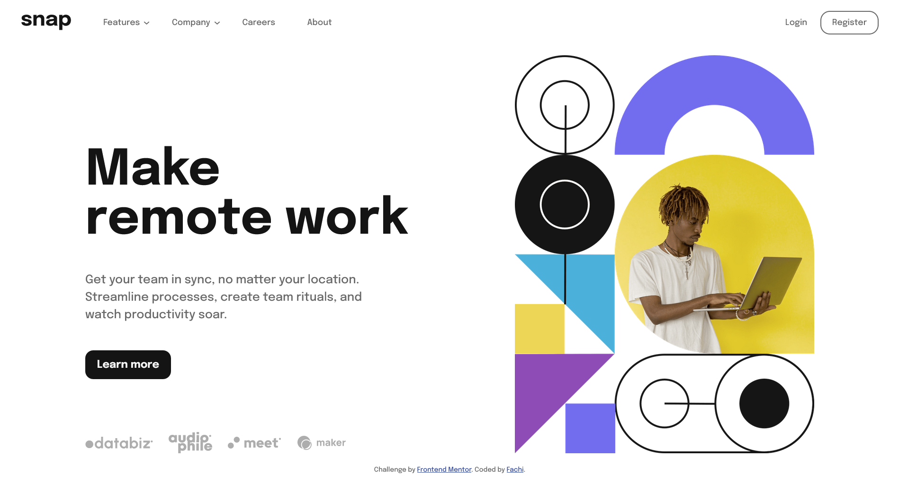

# Frontend Mentor - Intro section with dropdown navigation solution

This is a solution to the [Intro section with dropdown navigation challenge on Frontend Mentor](https://www.frontendmentor.io/challenges/intro-section-with-dropdown-navigation-ryaPetHE5). Frontend Mentor challenges help you improve your coding skills by building realistic projects.

## Table of contents

-  [Overview](#overview)
   -  [The challenge](#the-challenge)
   -  [Screenshot](#screenshot)
   -  [Links](#links)
-  [My process](#my-process)
   -  [Built with](#built-with)
   -  [What I learned](#what-i-learned)
   -  [Useful resources](#useful-resources)
-  [Author](#author)

## Overview

### The challenge

Users should be able to:

-  View the relevant dropdown menus on desktop and mobile when interacting with the navigation links
-  View the optimal layout for the content depending on their device's screen size
-  See hover states for all interactive elements on the page

### Screenshot



### Links

-  Solution URL: [Frontend Mentor](https://www.frontendmentor.io/solutions/responsive-landing-page-using-css-and-javascript-o3glWGpVDE)
-  Live Site URL: [Github Pages](https://fachi-r.github.io/snap-intro-page/)

## My process

### Built with

-  Semantic HTML5 markup
-  CSS custom properties
-  Flexbox
-  CSS Grid
-  Fluid Typography
-  Mobile-first workflow

### What I learned

The _:is_ selector made writing hover states for all these properties at once much easier

```css
:is(.list_item, .accordion_button, .accordion_item p):hover {
	color: var(--almost-black);
}
```

For the arrow next to the dropdown, instead of using two different SVG's and switching between them when clicked, I used the same SVG and rotated it as needed using css.

```css
.accordion_button::after {
	content: url("./images/icon-arrow-down.svg");
	position: absolute;
	top: 50%;
	transform: translateY(-60%);
	...;
}
.accordion_button.active::after {
	transform: rotateX(0.5turn) translateY(35%);
}
```

This piece of javascript helped me figure out the dimensions of the screen and switch image sources between desktop and mobile versions.
I used aspect ratio instead of screen width because the image provided sometimes leaves too much white space if based on width (e.g on Tablets)

```js
// If screen is greater than [width]
let media = window.matchMedia("(min-width: 700px)");

let aspectRatio = window.innerWidth / window.innerHeight;

// Setting mobile || desktop images based on screen size
function setImgSrc(_aspectRatio, _media) {
	if (_media.matches || _aspectRatio < 0.5) {
		images.forEach((image) => {
			const newImageSrc = image.src.replace("mobile", "desktop");
			image.src = newImageSrc;
		});
	} else {
		images.forEach((image) => {
			const newImageSrc = image.src.replace("desktop", "mobile");
			image.src = newImageSrc;
		});
	}
}
```

### Useful resources

-  [Utopia](https://utopia.fyi/) - Website. This helped me with setting Flid typography and fonts that scale with the screen size.
-  [Web Dev Simplified](https://youtube.com/@WebDevSimplified) - This is an amazing youtube channel that helped me when figuring out how to make the dropdown menu. He also has other really helpful tutorials for react and general web dev projects (Hence the name lol)
-  [Online Tutorials](https://youtube.com/@OnlineTutorialsYT) - Another youtube channel that gave me ideas for the dropdown menu. [This video](https://youtu.be/dPLHi7tsoFU) in particular was a major contributor.

## Author

Where to find me 😄

-  Github - [Fachi-r](https://github.com/Fachi-r)
-  Frontend Mentor - [@Fachi-r](https://www.frontendmentor.io/profile/yFachi-r)
-  Twitter - [@\_fachi_0](https://www.twitter.com/_fachi_0)
